# RadarIdentifySystem 重构为标准 MVC 架构设计文档

## 概述

本文档详述了将 RadarIdentifySystem 雷达信号识别系统从当前高耦合的单体架构重构为标准且规范的 MVC（Model-View-Controller）架构的设计方案。重构目标是解决现版本项目中耦合度极高的算法流程和杂乱的层间调用问题，构建清晰、解耦、可扩展的文件代码结构。

### 技术栈升级
- **界面框架**：PyQt5 → PyQt6 + PyQt6-Fluent-Widgets
- **架构模式**：单体架构 → 标准 MVC 架构
- **通信机制**：V-C 层使用信号与槽，C-M 层根据任务性质使用观察者模式或 Qt 信号与槽

### 保留要求
- 保留所有算法流程和计算逻辑
- 保留 UI 样式骨架和主题色
- 保留所有业务功能模块

### 文件重构对应关系表

| 重构后文件 | 原项目文件 | 重构类型 | 说明 |
|------------|------------|----------|------|
| **App 层** |||||
| app/main.py | main.py | 直接迁移 | 升级为 PyQt6 + FluentWindow |
| app/config/settings.py | ui/default_config.py | 重构 | 拆分为设置配置 |
| app/config/themes.py | ui/style_manager.py | 重构 | 主题管理专用 |
| **Models 层** |||||
| models/data/radar_data.py | ui/data_controller.py | 抽取 | 数据结构封装 |
| models/data/config_data.py | config/*.json + ui/default_config.py | 合并重构 | 配置数据统一管理 |
| models/processors/data_processor.py | cores/data_processor.py | 直接迁移 | 算法保持不变 |
| models/processors/cluster_processor.py | cores/cluster_processor.py | 直接迁移 | 算法保持不变 |
| models/processors/model_predictor.py | cores/model_predictor.py | 直接迁移 | 算法保持不变 |
| models/processors/params_extractor.py | cores/params_extractor.py | 直接迁移 | 算法保持不变 |
| models/services/data_service.py | ui/data_controller.py | 抽取重构 | 业务逻辑抽取 |
| models/services/analysis_service.py | ui/data_controller.py | 抽取重构 | 分析逻辑抽取 |
| models/services/export_service.py | ui/data_controller.py | 抽取重构 | 导出逻辑抽取 |
| models/utils/log_manager.py | cores/log_manager.py | 直接迁移 | 工具类保持 |
| models/services/plot_service.py | ui/main_window.py | 抽取重构 | 绘图业务逻辑抽取 |
| models/services/visualization_service.py | ui/merge_visualization_manager.py | 抽取重构 | 可视化业务逻辑抽取 |
| **Views 层** |||||
| views/interfaces/analysis_interface.py | ui/main_window.py | 拆分重构 | 主界面重构为子界面 |
| views/interfaces/model_interface.py | ui/model_import_dialog.py | 重构 | 对话框→子界面 |
| views/interfaces/config_interface.py | ui/config_window.py | 重构 | 对话框→子界面 |
| views/modules/scroll_modules/view_panel.py | ui/main_window.py | 拆分重构 | 滚动视图面板拆分 |
| views/modules/scroll_modules/merge_control_panel.py | ui/scroll_layout_manager.py | 拆分重构 | 合并控制面板拆分 |
| views/modules/scroll_modules/merge_params_module.py | ui/main_window.py | 拆分重构 | 合并参数UI拆分 |
| views/modules/scroll_modules/merge_visual_module.py | ui/merge_visualization_manager.py | 直接迁移 | 合并可视化管理 |
| views/modules/panel_modules/params_config_module.py | ui/main_window.py | 拆分重构 | 参数配置面板拆分 |
| views/modules/panel_modules/slice_process_module.py | ui/main_window.py | 拆分重构 | 切片处理面板拆分 |
| views/modules/panel_modules/fullspeed_process_module.py | ui/main_window.py | 拆分重构 | 全速处理面板拆分 |
| views/components/plot_component.py | ui/plot_widget.py | 直接迁移 | 绘图组件升级 |
| views/components/progress_component.py | ui/loading_spinner.py + ui/rectangle_animation.py | 合并重构 | 进度组件统一 |
| views/components/param_config_widget.py | ui/main_window.py | 拆分重构 | 参数配置框组件 |
| views/components/switch_component.py | ui/switch_widget.py | 直接迁移 | 开关组件升级 |
| views/components/scroll_container_component.py | ui/horizontal_scroll_container.py | 直接迁移 | 滚动容器升级 |
| views/components/layout_manager_component.py | ui/scroll_layout_manager.py | 直接迁移 | 布局管理器升级 |
| views/styles/style_manager.py | ui/style_manager.py | 直接迁移 | 样式管理器升级 |
| views/styles/ui_functions.py | ui/ui_functions.py | 直接迁移 | UI工具函数升级 |
| **Controllers 层** |||||
| controllers/main_controller.py | ui/main_window.py | 抽取重构 | 主控制逻辑抽取 |
| controllers/data_controller.py | ui/data_controller.py | 抽取重构 | 控制逻辑抽取 |
| controllers/analysis_controller.py | ui/data_controller.py | 抽取重构 | 分析控制逻辑抽取 |
| controllers/ui/panel_controller.py | ui/main_window.py | 抽取重构 | 面板控制逻辑抽取 |
| controllers/ui/param_controller.py | ui/main_window.py | 抽取重构 | 参数配置控制逻辑抽取 |
| controllers/ui/slice_controller.py | ui/main_window.py | 抽取重构 | 切片处理控制逻辑抽取 |
| controllers/ui/fullspeed_controller.py | ui/main_window.py | 抽取重构 | 全速处理控制逻辑抽取 |
| controllers/ui/merge_controller.py | ui/scroll_layout_manager.py | 抽取重构 | 合并控制逻辑抽取 |
| controllers/ui/class_control_controller.py | ui/scroll_layout_manager.py | 抽取重构 | 类别控制逻辑抽取 |
| **资源文件** |||||
| resources/configs/default_params_system.json | config/default_params_system.json | 直接迁移 | 配置文件迁移 |
| resources/configs/default_params_user.json | config/default_params_user.json | 直接迁移 | 配置文件迁移 |
| build/build.py | build.py | 直接迁移 | 构建脚本升级 |
| build/requirements.txt | requirements.txt | 直接迁移 | 依赖清单升级 |

### 当前架构问题
1. **高耦合性**：`data_controller.py` 混合了 Model 和 Controller 职责
2. **职责混乱**：`main_window.py` 同时承担 View 和 Controller 功能
3. **直接依赖**：UI 层直接调用算法层，违反分层原则
4. **状态管理混乱**：业务状态分散在 UI 组件中
5. **测试困难**：业务逻辑与 UI 紧耦合，难以单元测试

## MVC 重构目标架构

### 重构后目录结构（文件来源标注）
```
RadarIdentifySystem_Refactoring/
├── app/                     # 应用程序包
│   ├── __init__.py         # 新增
│   ├── main.py             # 重构自: main.py
│   └── config/             # 应用启动配置（仅保留非业务配置）
│       ├── __init__.py     # 新增
│       ├── settings.py     # 应用启动设置（日志级别、调试模式等）
│       └── paths.py        # 路径配置（资源路径、临时目录等）
├── models/                  # Model 层 - 数据模型与业务逻辑
│   ├── __init__.py         # 新增
│   ├── base/               # 基础模型
│   │   ├── __init__.py     # 新增
│   │   ├── observable.py   # 新增 - 观察者模式基类
│   │   └── model_base.py   # 新增 - 模型基类
│   ├── data/               # 数据模型
│   │   ├── __init__.py     # 新增
│   │   ├── radar_data.py   # 新增 - 封装原data_controller.py中的数据结构
│   │   └── config_data.py  # 重构自: ui/default_config.py + config/目录
│   ├── config/             # 配置模型（业务配置数据）
│   │   ├── __init__.py     # 新增
│   │   ├── user_config.py  # 重构自: ui/default_config.py（用户个性化配置）
│   │   ├── algorithm_config.py # 算法参数配置模型
│   │   └── ui_preferences.py   # UI偏好设置模型
│   ├── theme/              # 主题模型（业务数据）
│   │   ├── __init__.py     # 新增
│   │   ├── theme_data.py   # 重构自: ui/style_manager.py（主题数据模型）
│   │   └── theme_manager.py # 重构自: ui/style_manager.py（主题业务逻辑）
│   ├── ui/                 # UI相关模型
│   │   ├── __init__.py     # 新增
│   │   └── ui_state.py     # 重构自: ui/ui_functions.py（UI状态模型）
│   ├── processors/         # 算法处理器（业务逻辑）
│   │   ├── __init__.py     # 新增
│   │   ├── data_processor.py     # 重构自: cores/data_processor.py
│   │   ├── cluster_processor.py  # 重构自: cores/cluster_processor.py
│   │   ├── model_predictor.py    # 重构自: cores/model_predictor.py
│   │   └── params_extractor.py   # 重构自: cores/params_extractor.py
│   ├── services/           # 业务服务
│   │   ├── __init__.py     # 新增
│   │   ├── data_service.py       # 重构自: ui/data_controller.py (业务逻辑部分)
│   │   ├── analysis_service.py   # 重构自: ui/data_controller.py (分析逻辑部分)
│   │   ├── export_service.py     # 重构自: ui/data_controller.py (导出逻辑部分)
│   │   ├── config_service.py     # 新增 - 配置管理服务
│   │   ├── theme_service.py      # 新增 - 主题管理服务
│   │   ├── plot_service.py       # 重构自: ui/main_window.py (绘图业务逻辑)
│   │   ├── visualization_service.py # 重构自: ui/merge_visualization_manager.py (可视化业务逻辑)
│   │   └── merge_service.py      # 新增 - 合并处理服务
│   └── utils/              # 模型工具
│       ├── __init__.py     # 新增
│       ├── log_manager.py        # 重构自: cores/log_manager.py
│       ├── thread_worker.py      # 重构自: cores/ThreadWorker.py
│       ├── file_utils.py         # 新增 - 文件操作工具
│       └── config_utils.py       # 新增 - 配置工具
├── views/                   # View 层 - 用户界面（简化后）
│   ├── __init__.py         # 重构自: ui/__init__.py
│   ├── main_window.py      # 重构自: ui/main_window.py (MSFluentWindow主窗口)
│   ├── base/               # 基础视图组件
│   │   ├── __init__.py     # 新增
│   │   ├── base_window.py  # 新增 - 窗口基类
│   │   ├── base_widget.py  # 新增 - 控件基类
│   │   └── fluent_components.py # 新增 - Fluent 组件封装
│   ├── interfaces/         # FluentWindow 子界面
│   │   ├── __init__.py     # 新增
│   │   ├── main_interface.py     # 重构自: ui/main_window.py (主界面部分)
│   │   ├── model_management_interface.py # 重构自: ui/model_import_dialog.py
│   │   ├── config_interface.py   # 重构自: ui/config_window.py
│   │   └── settings_interface.py # 新增 - 设置界面
│   ├── modules/            # 功能模块（采用您的方案结构）
│   │   ├── __init__.py     # 新增
│   │   ├── scroll_module/  # 滚动模块
│   │   │   ├── __init__.py # 新增
│   │   │   ├── scroll_container.py # 重构自: ui/horizontal_scroll_container.py
│   │   │   ├── layout_manager.py   # 重构自: ui/scroll_layout_manager.py (移入scroll_module)
│   │   │   ├── view_panel/          # 视图面板
│   │   │   │   ├── __init__.py     # 新增
│   │   │   │   ├── slice_view.py   # 重构自: ui/main_window.py (切片视图部分)
│   │   │   │   ├── cluster_view.py # 重构自: ui/main_window.py (聚类视图部分)
│   │   │   │   └── merge_view.py   # 重构自: ui/main_window.py (合并视图部分)
│   │   │   └── merge_control_panel/ # 合并控制面板
│   │   │       ├── __init__.py     # 新增
│   │   │       ├── merge_result_panel.py # 重构自: ui/merge_visualization_manager.py (合并结果面板)
│   │   │       └── class_control_panel.py # 重构自: ui/merge_visualization_manager.py (类别控制面板)
│   │   └── panel_module/   # 面板模块
│   │       ├── __init__.py # 新增
│   │       ├── parameter_panel.py  # 重构自: ui/main_window.py (参数配置面板)
│   │       ├── slice_panel.py      # 重构自: ui/main_window.py (切片控制面板)
│   │       └── fullspeed_panel.py  # 重构自: ui/main_window.py (全速处理面板)
│   └── components/         # 基础组件（保留原项目组件）
│       ├── __init__.py     # 新增
│       ├── plot_widget.py          # 重构自: ui/plot_widget.py
│       ├── loading_spinner.py      # 重构自: ui/loading_spinner.py
│       ├── rectangle_animation.py  # 重构自: ui/rectangle_animation.py
│       ├── switch_widget.py        # 重构自: ui/switch_widget.py
│       ├── bubble_card.py          # 重构自: ui/bubble_card.py
│       ├── data_table.py           # 新增 - 基于原项目表格功能
│       └── param_config_widget.py  # 新增 - 参数配置框组件
├── controllers/             # Controller 层 - 控制逻辑
│   ├── __init__.py         # 新增
│   ├── base/               # 基础控制器
│   │   ├── __init__.py     # 新增
│   │   └── base_controller.py      # 新增 - 控制器基类
│   ├── main_controller.py          # 重构自: ui/main_window.py (主控制逻辑部分)
│   ├── data_controller.py          # 重构自: ui/data_controller.py (控制逻辑部分)
│   ├── analysis_controller.py      # 重构自: ui/data_controller.py (分析控制部分)
│   ├── config_controller.py        # 新增 - 配置控制器
│   ├── theme_controller.py         # 新增 - 主题控制器
│   ├── plot_controller.py          # 新增 - 绘图控制器
│   ├── visualization_controller.py # 新增 - 可视化控制器
│   └── ui/                         # UI控制器细化分层
│       ├── __init__.py             # 新增
│       ├── slice_controller.py         # 重构自: ui/main_window.py (切片处理控制)
│       ├── fullspeed_controller.py     # 重构自: ui/main_window.py (全速处理控制)
│       ├── merge_controller.py         # 重构自: ui/scroll_layout_manager.py (合并控制)
│       └── class_control_controller.py # 重构自: ui/scroll_layout_manager.py (类别控制)
├── resources/              # 资源文件
│   ├── icons/              # 图标资源
│   ├── images/             # 图片资源
│   ├── models/             # 深度学习模型
│   └── configs/            # 默认配置文件（只读）
│       ├── default_params_system.json # 来源: config/default_params_system.json
│       └── default_params_user.json   # 来源: config/default_params_user.json
├── tests/                  # 测试代码
│   ├── __init__.py         # 新增
│   ├── test_models/        # 模型测试
│   ├── test_controllers/   # 控制器测试
│   └── test_integration/   # 集成测试
├── build/                  # 构建脚本
│   ├── __init__.py         # 新增
│   ├── build.py           # 重构自: build.py
│   └── requirements.txt   # 重构自: requirements.txt
└── README.md              # 重构自: README.md
```

## Model 层设计

### 数据模型设计

#### RadarData 模型
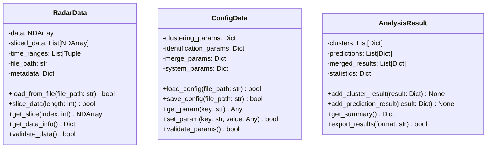

#### 观察者模式基类
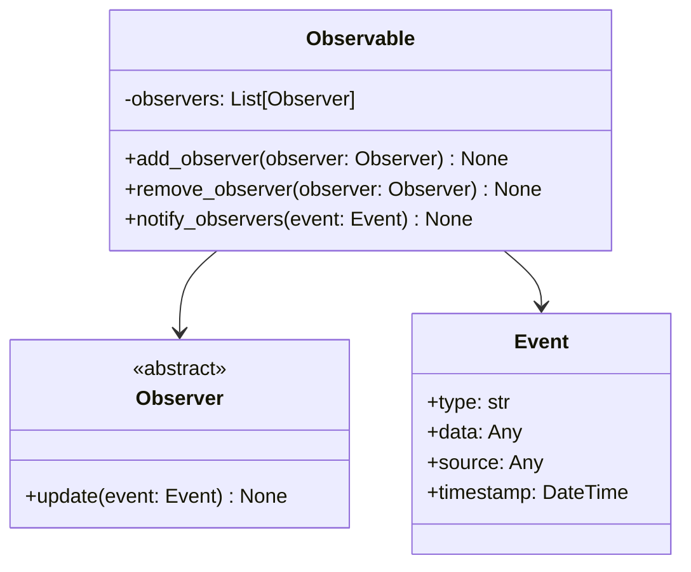

### 业务服务设计

#### 数据处理服务
```mermaid
classDiagram
    class DataService {
        -data_model: RadarData
        -config_model: ConfigData
        -logger: LogManager
        +import_data(file_path: str) bool
        +process_data() bool
        +slice_data(params: Dict) bool
        +validate_data() bool
        +get_data_statistics() Dict
    }
    
    class AnalysisService {
        -cluster_processor: ClusterProcessor
        -model_predictor: ModelPredictor
        -params_extractor: ParamsExtractor
        +perform_clustering(data: NDArray, params: Dict) List[Dict]
        +perform_identification(clusters: List[Dict]) List[Dict]
        +merge_results(results: List[Dict], params: Dict) List[Dict]
        +full_speed_analysis(data: RadarData) AnalysisResult
    }
    
    class ExportService {
        +export_results(results: AnalysisResult, format: str) bool
        +save_to_file(data: Any, file_path: str) bool
    }
    
    class PlotService {
        -active_plots: Dict[str, PlotData]
        -plot_configs: Dict
        +create_plot_data(plot_type: str, data: NDArray) PlotData
        +update_plot_data(plot_id: str, data: NDArray) PlotData
        +clear_all_plots() None
        +get_plot_config(plot_type: str) Dict
    }
    
    class VisualizationService {
        -visualization_configs: Dict
        -merge_settings: Dict
        +setup_merge_visualization(params: Dict) Dict
        +generate_visualization_data(data: Dict) Dict
        +toggle_visualization_mode(mode: str) Dict
    }
```

## View 层设计

### FluentWindow 主界面架构设计

#### 主界面结构重构
取消原项目的菜单栏设计，采用 FluentWindow 的导航界面，包含4个子界面：

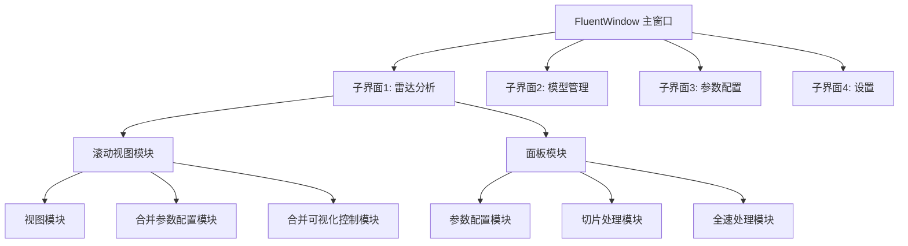

#### 子界面设计

**子界面1 - 雷达分析界面 (analysis_interface.py)**
- 重构自: `ui/main_window.py` 主界面部分
- 包含滚动视图模块和面板模块
- 取消原有的菜单栏功能

**子界面2 - 模型管理界面 (model_interface.py)**
- 重构自: `ui/model_import_dialog.py`
- 从对话框重构为独立界面
- 提供模型加载、管理功能

**子界面3 - 参数配置界面 (config_interface.py)**
- 重构自: `ui/config_window.py`
- 从对话框重构为独立界面
- 提供系统参数配置功能

**子界面4 - 设置界面 (settings_interface.py)**
- 新增界面（暂时留空）
- 用于应用程序设置、主题切换等

### PyQt6-Fluent-Widgets 组件选择

#### 主要组件映射
| 原组件 | PyQt6-Fluent-Widgets 组件 | 用途 |
|--------|---------------------------|------|
| QPushButton | PushButton / PrimaryPushButton | 主要操作按钮 |
| QLineEdit | LineEdit / SearchLineEdit | 文本输入 |
| QComboBox | ComboBox | 下拉选择 |
| QProgressBar | ProgressBar / ProgressRing | 进度显示 |
| QTableWidget | TableView | 数据表格 |
| QTabWidget | TabBar + QStackedWidget | 标签页 |
| QGroupBox | GroupHeaderCardWidget | 分组容器 |
| QSlider | Slider | 滑块控件 |
| QSpinBox | SpinBox | 数值输入 |
| QCheckBox | CheckBox / SwitchButton | 选择控件 |
| 自定义加载动画 | IndeterminateProgressRing | 加载指示器 |
| QMainWindow | FluentWindow | 主窗口 |
| QMenuBar | NavigationInterface | 导航栏 |
| QScrollArea | ScrollArea | 滚动区域 |

## 🏗️ **更合理的 MVC 分层配置设计**

### 🎯 **关键洞察：Theme 和 Config 本质是业务数据！**

经过深入分析，Theme 和 Config 确实应该根据其本质进行正确分层：

#### 📋 **分层职责重新定义**

| 层级 | 职责 | 应该包含 | 不应该包含 |
|------|------|----------|------------|
| **app/config/** | 🔧 应用启动配置 | 日志级别、调试模式、路径配置 | ❌ 用户偏好、主题数据 |
| **models/** | 💾 业务数据+逻辑 | 用户配置、主题管理、业务参数 | ❌ 应用启动参数 |
| **resources/** | 📁 静态资源 | 默认配置文件、图标、模型 | ❌ 动态配置逻辑 |

#### 🔍 **Models层 vs Controllers层：主题/配置职责详解**

##### **Models层职责** (数据模型 + 业务逻辑)

**Config相关**:
- `models/config/user_config.py` - 用户配置数据模型
- `models/config/algorithm_config.py` - 算法参数配置模型
- `models/services/config_service.py` - 配置业务逻辑（加载、保存、验证）

**Theme相关**:
- `models/theme/theme_data.py` - 主题数据模型
- `models/theme/theme_manager.py` - 主题业务逻辑
- `models/services/theme_service.py` - 主题服务（切换、应用、验证）

##### **Controllers层职责** (用户交互 + 协调逻辑)

**Config相关**:
- `controllers/config_controller.py` - 响应用户配置操作、协调Model和View
  - 处理「用户点击配置按钮」
  - 协调「配置界面 ↔ 配置服务」
  - 处理配置变更的UI反馈

**Theme相关**:
- `controllers/theme_controller.py` - 响应用户主题切换、协调Model和View
  - 处理「用户选择主题」
  - 协调「设置界面 ↔ 主题服务」
  - 通知所有View更新主题

##### **职责区别示例**
```python
# ✅ Models层 - 业务逻辑
class ThemeService:
    def switch_theme(self, theme_name: str):
        """执行主题切换的业务逻辑"""
        theme_data = self.load_theme(theme_name)
        self.validate_theme_compatibility(theme_data)
        self.apply_theme_settings(theme_data)
        self.save_user_preference(theme_name)
        
# ✅ Controllers层 - 交互协调
class ThemeController:
    def handle_theme_selection(self, theme_name: str):
        """响应用户主题选择操作"""
        try:
            self.theme_service.switch_theme(theme_name)  # 调用业务逻辑
            self.notify_all_views_update()               # 协调UI更新
            self.show_success_message()                  # 用户反馈
        except ThemeError as e:
            self.show_error_message(str(e))              # 错误处理
```

### 🔄 **正确的数据流向**
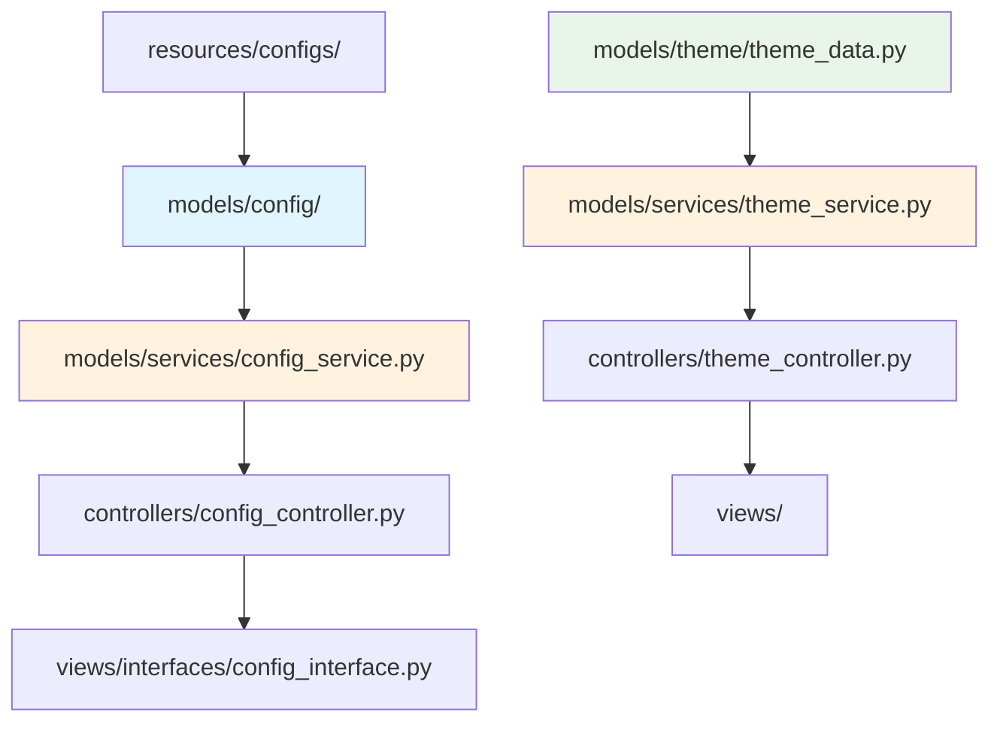

### 📂 **优化后的分层逻辑**

#### **app/config/** - 纯应用级配置
```python
# app/config/settings.py
class AppSettings:
    DEBUG = False
    LOG_LEVEL = "INFO" 
    TEMP_DIR = "./temp"
    MAX_THREADS = 4
    
# app/config/paths.py  
class PathConfig:
    RESOURCES_DIR = "./resources"
    MODELS_DIR = "./resources/models"
    CONFIG_FILES_DIR = "./resources/configs"
```

#### **models/** - 业务数据与逻辑
```python
# models/config/user_config.py
class UserConfig(Observable):
    def __init__(self):
        self.clustering_params = {...}
        self.identification_params = {...}
        self.ui_preferences = {...}
        
    def save_to_file(self, path: str):
        """保存用户配置到文件"""
        pass
        
# models/theme/theme_manager.py
class ThemeManager(Observable):
    def __init__(self):
        self.current_theme = "fluent_light"
        self.available_themes = {...}
        
    def switch_theme(self, theme_name: str):
        """切换主题并通知观察者"""
        self.current_theme = theme_name
        self.notify_observers(ThemeChangedEvent(theme_name))
        
# models/services/config_service.py
class ConfigService:
    def __init__(self):
        self.user_config = UserConfig()
        
    def load_default_config(self):
        """从 resources/configs/ 加载默认配置"""
        pass
        
    def save_user_config(self):
        """保存用户个性化配置"""
        pass
```

### ⚡ **关键优势**

#### 1. **符合 MVC 原则**
- **Model** 管理业务数据（用户配置、主题偏好）
- **Controller** 处理配置变更逻辑
- **View** 仅负责展示和用户交互

#### 2. **数据持久化合理**
```python
# ✅ 正确：在 Model 层处理数据持久化
class UserConfig:
    def save_preferences(self):
        # 保存到用户目录的配置文件
        pass
        
    def load_from_system(self):
        # 从系统加载用户配置
        pass

# ❌ 错误：在 app/config 中处理业务数据
```

#### 3. **业务逻辑集中**
```python
# models/theme/theme_manager.py
class ThemeManager:
    def apply_theme_to_widget(self, widget, theme_name):
        """主题应用的业务逻辑"""
        theme_data = self.get_theme_data(theme_name)
        # 复杂的主题应用逻辑
        pass
        
    def validate_theme_compatibility(self, theme_name):
        """主题兼容性验证逻辑"""
        pass
```

#### 4. **更好的可测试性**
```python
# 可以独立测试配置逻辑
def test_theme_switching():
    theme_manager = ThemeManager()
    theme_manager.switch_theme("dark_mode")
    assert theme_manager.current_theme == "dark_mode"
```

### 🎨 **实际使用示例**
```python
# Controller 层协调
class ThemeController:
    def __init__(self):
        self.theme_manager = ThemeManager()  # Model
        self.theme_manager.add_observer(self)
        
    def handle_theme_change_request(self, theme_name):
        # 业务逻辑验证
        if self.theme_manager.validate_theme_compatibility(theme_name):
            self.theme_manager.switch_theme(theme_name)
            
    def update(self, event: ThemeChangedEvent):
        # 通知所有 View 更新
        self.notify_views(event)

# View 层使用
class SettingsInterface:
    def __init__(self, theme_controller):
        self.theme_controller = theme_controller
        
    def on_theme_selection(self, theme_name):
        # 仅处理 UI 交互，业务逻辑交给 Controller
        self.theme_controller.handle_theme_change_request(theme_name)
```

**结论：Theme 和 Config 确实应该作为业务数据放在 models/ 中**，这样更符合 MVC 的分层原则和数据流向。🎯

### UI 模块化详细设计（融合方案）

#### 界面层级结构
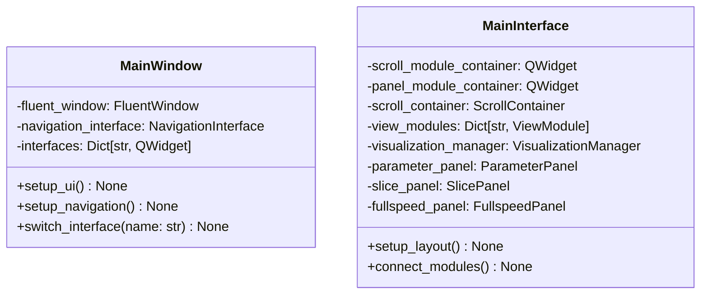

#### 滚动模块设计（scroll_module）
```mermaid
classDiagram
    class ScrollContainer {
        -container_widget: QScrollArea
        -content_widget: QWidget
        -layout_manager: LayoutManager
        +enable_scroll(enabled: bool) None
        +reset_scroll() None
        +add_content(widget: QWidget) None
    }
    
    class SliceView {
        -plot_displays: List[PlotWidget]
        -data_display: QWidget
        +display_slice(data: NDArray, index: int) None
        +update_plots(plot_data: Dict) None
        +clear_display() None
    }
    
    class ClusterView {
        -cluster_plots: List[PlotWidget]
        -cluster_info: BubbleCard
        +display_clusters(clusters: List[Dict]) None
        +highlight_cluster(cluster_id: int) None
        +show_cluster_stats(stats: Dict) None
    }
    
    class MergeView {
        -merge_plots: List[PlotWidget]
        -merge_controls: QWidget
        +display_merge_results(results: List[Dict]) None
        +update_merge_params(params: Dict) None
    }
    
    class MergeResultPanel {
        -result_displays: List[QWidget]
        -result_tables: List[DataTable]
        +show_merge_results(results: List[Dict]) None
        +update_result_display(data: Dict) None
        +clear_results() None
    }
    
    class ClassControlPanel {
        -class_checkboxes: Dict[str, CheckBox]
        -control_buttons: List[PushButton]
        +setup_class_controls(classes: List[str]) None
        +get_selected_classes() List[str]
        +toggle_class_visibility(class_name: str, visible: bool) None
        +select_all_classes() None
        +deselect_all_classes() None
    }
```

#### 面板模块设计（panel_module）
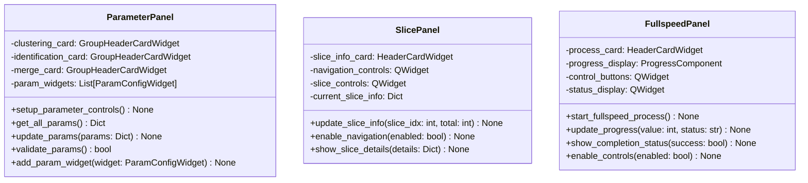

### 自定义组件保留策略

#### 保留的原项目组件
1. **LoadingSpinner** (ui/loading_spinner.py)
   - 保留原有的自定义加载动画
   - 集成到 ProgressComponent 中
   - 作为 IndeterminateProgressRing 的补充

2. **RectangleAnimation** (ui/rectangle_animation.py)
   - 保留全速处理时的矩形动画效果
   - 重构为 ProgressComponent 的一部分

3. **PlotWidget** (ui/plot_widget.py)
   - 保留自定义绘图功能
   - 升级为 PlotComponent
   - 集成 Fluent 样式系统

4. **BubbleCard** (ui/bubble_card.py)
   - 重构为 CardComponent 的基础实现
   - 与 Fluent CardWidget 系统集成

5. **ParamConfigWidget** (新增组件)
   - 作为参数配置面板的基础布局单元
   - 提供标准化的参数输入控件（文本框、数值框、下拉框等）
   - 支持参数验证和错误提示

#### 组件升级策略
- 保持原有功能不变
- 适配 PyQt6 API
- 集成 Fluent Design 样式
- 提供向后兼容接口

## Controller 层设计

### FluentWindow 导航架构
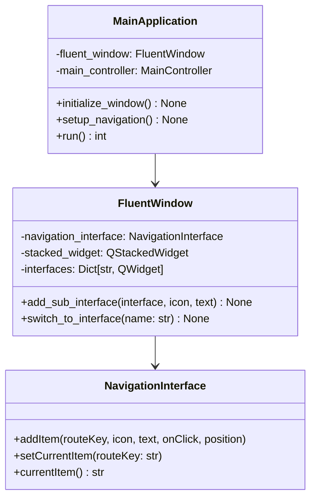

#### 导航项配置
```python
# 导航项设置
NAVIGATION_ITEMS = [
    {
        "key": "analysis",
        "icon": FluentIcon.CHART,
        "text": "雷达分析",
        "interface_class": AnalysisInterface,
        "position": NavigationItemPosition.TOP
    },
    {
        "key": "model",
        "icon": FluentIcon.ROBOT,
        "text": "模型管理",
        "interface_class": ModelInterface,
        "position": NavigationItemPosition.TOP
    },
    {
        "key": "config",
        "icon": FluentIcon.SETTING,
        "text": "参数配置",
        "interface_class": ConfigInterface,
        "position": NavigationItemPosition.TOP
    },
    {
        "key": "settings",
        "icon": FluentIcon.DEVELOPER_TOOLS,
        "text": "设置",
        "interface_class": SettingsInterface,
        "position": NavigationItemPosition.BOTTOM
    }
]
```

### 控制器架构

### 控制器架构
```mermaid
classDiagram
    class BaseController {
        <<abstract>>
        -model: Any
        -view: Any
        +connect_signals() None
        +handle_error(error: Exception) None
        +log_action(action: str) None
    }
    
    class MainController {
        -data_controller: DataController
        -analysis_controller: AnalysisController
        -ui_controllers: Dict[str, BaseController]
        -plot_controller: PlotController
        -main_view: MainWindowView
        +initialize_application() None
        +shutdown_application() None
        +coordinate_controllers() None
        +register_ui_controller(name: str, controller: BaseController) None
    }
    
    class DataController {
        -data_service: DataService
        -data_view: DataInputWidget
        +handle_file_import() None
        +handle_data_validation() None
        +handle_config_update() None
        +handle_data_slice() None
    }
    
    class AnalysisController {
        -analysis_service: AnalysisService
        -analysis_view: AnalysisWidget
        -result_view: ResultWidget
        +handle_analysis_start() None
        +handle_parameter_change() None
        +handle_progress_update() None
        +handle_analysis_complete() None
    }
    
    %% UI控制器细化分层
    class NavigationController {
        -navigation_interface: NavigationInterface
        +handle_navigation_change(route: str) None
        +update_navigation_state() None
        +setup_navigation_items() None
    }
    
    class WindowController {
        -fluent_window: FluentWindow
        +handle_window_resize() None
        +handle_window_close() None
        +handle_window_minimize() None
        +setup_window_properties() None
    }
    
    class InterfaceController {
        -interfaces: Dict[str, QWidget]
        +switch_interface(interface_name: str) None
        +register_interface(name: str, widget: QWidget) None
        +get_current_interface() QWidget
    }
    
    class ScrollController {
        -scroll_container: ScrollContainer
        -layout_manager: LayoutManager
        +handle_scroll_update() None
        +handle_layout_change() None
        +reset_scroll_position() None
        +manage_scroll_content() None
    }
    
    class PanelController {
        -active_panels: Dict[str, QWidget]
        +show_panel(panel_name: str) None
        +hide_panel(panel_name: str) None
        +toggle_panel(panel_name: str) None
        +coordinate_panel_layout() None
    }
    
    class ParamController {
        -param_widgets: List[ParamConfigWidget]
        -param_service: ConfigService
        +handle_param_change(param_name: str, value: Any) None
        +validate_all_params() bool
        +reset_params_to_default() None
        +save_param_preset(name: str) None
    }
    
    class SliceController {
        -slice_panel: SlicePanel
        -data_service: DataService
        +handle_slice_navigation() None
        +handle_slice_processing() None
        +update_slice_info() None
        +manage_slice_display() None
    }
    
    class FullspeedController {
        -fullspeed_panel: FullspeedPanel
        -analysis_service: AnalysisService
        +handle_fullspeed_start() None
        +handle_progress_update() None
        +handle_fullspeed_complete() None
        +manage_fullspeed_ui_state() None
    }
    
    class MergeController {
        -merge_result_panel: MergeResultPanel
        -merge_service: MergeService
        +handle_merge_operation() None
        +update_merge_results() None
        +configure_merge_settings() None
    }
    
    class ClassControlController {
        -class_control_panel: ClassControlPanel
        +handle_class_selection() None
        +toggle_class_visibility() None
        +handle_select_all() None
        +handle_deselect_all() None
        +update_class_display() None
    }
    
    BaseController <|-- MainController
    BaseController <|-- DataController
    BaseController <|-- AnalysisController
    BaseController <|-- ParamController
    BaseController <|-- SliceController
    BaseController <|-- FullspeedController
    BaseController <|-- MergeController
    BaseController <|-- ClassControlController
```

### 信号与槽通信机制

#### V-C 层通信（信号与槽）
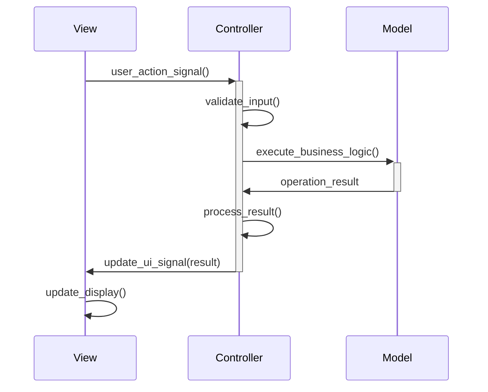

#### C-M 层通信（观察者模式 + 信号槽）
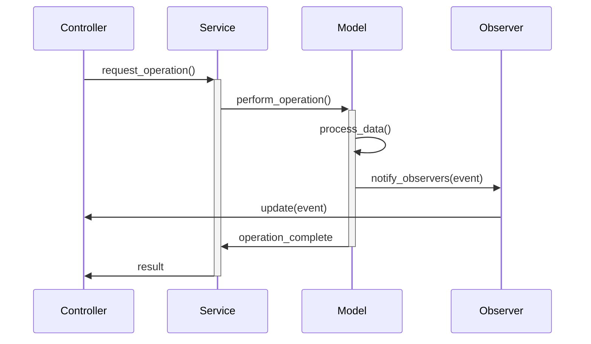

## 算法流程保留与重构

### 现有算法流程分析
1. **数据加载**：Excel 文件读取 → 数据格式转换 → 数据验证
2. **数据切片**：时间维度切片 → 切片验证 → 切片存储
3. **聚类分析**：CF 维度聚类 → PW 维度聚类 → 聚类结果合并
4. **特征识别**：PA 特征提取 → DTOA 特征提取 → 模型预测
5. **结果合并**：聚类结果合并 → 识别结果合并 → 最终结果生成

**注意**：原项目中的 `roughly_clustering.py` 为自定义DBSCAN实现，重构后将直接使用Python标准库中的 `sklearn.cluster.DBSCAN`，无需保留该文件。

### 重构后的算法流程映射
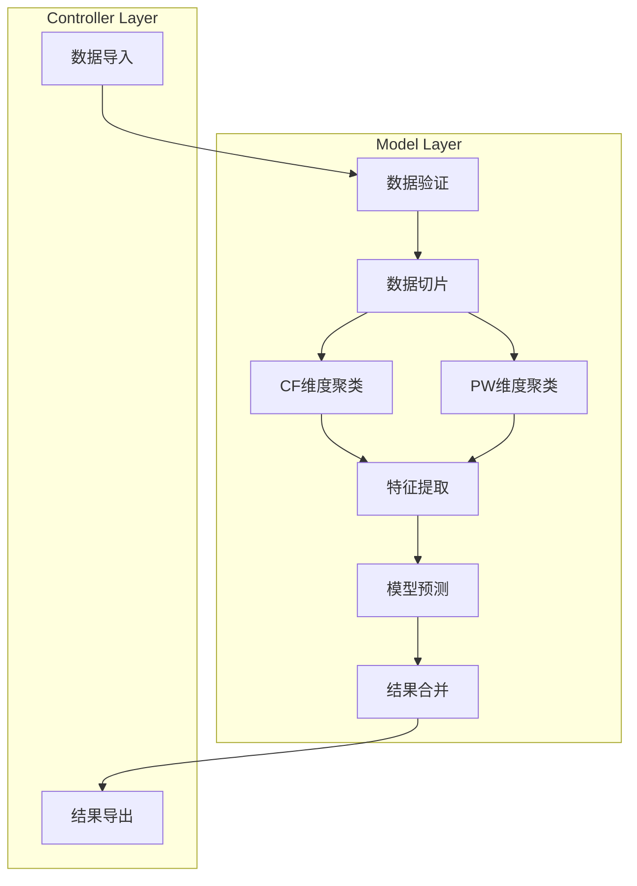

### 算法模块重构策略
1. **保持算法核心不变**：所有计算逻辑完全保留
2. **重构接口设计**：标准化输入输出接口
3. **增强错误处理**：完善异常处理机制
4. **优化性能**：保持原有的多线程处理能力
5. **提升可测试性**：将算法与 UI 解耦

#### 数据流设计

## 正确的 MVC 数据流

### 系统数据流
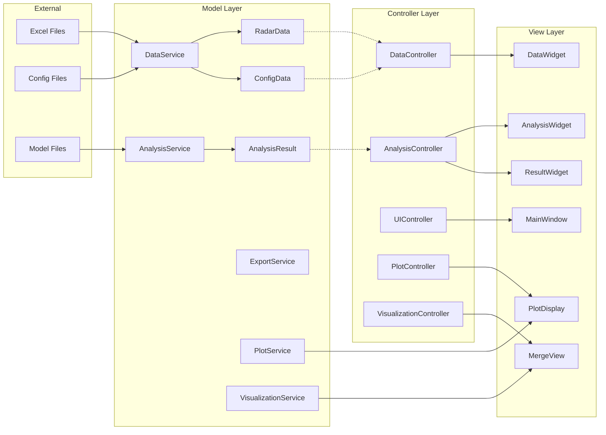

### 状态管理
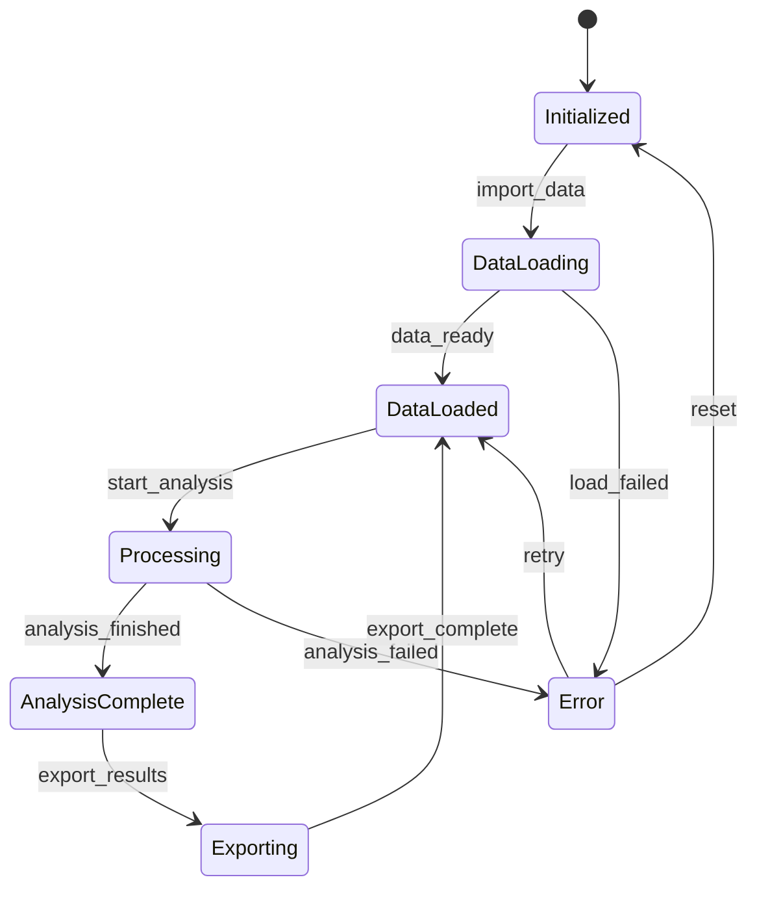

## 主题与样式设计

### 主题色彩保留
保留原项目的主要色彩方案：
- **主色调**：`#4772c3`（深蓝色）
- **辅助色**：`#5c8ad4`（浅蓝色）
- **强调色**：`#3c61a5`（深蓝色）

### 组件样式适配
将原有的 QSS 样式转换为 PyQt6-Fluent-Widgets 兼容的样式定义。

## 配置管理设计

### 配置架构
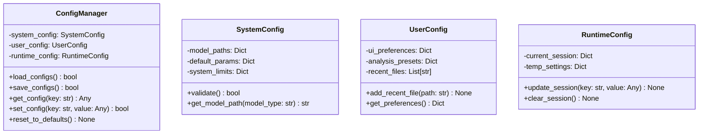

## 测试策略

### 单元测试设计
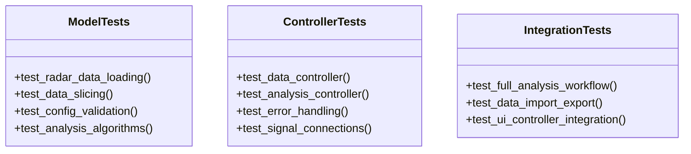

### 测试覆盖目标
- **模型层**：95% 代码覆盖率
- **控制器层**：90% 代码覆盖率
- **集成测试**：覆盖主要业务流程

## 性能优化考虑

### 多线程处理保留
保留原项目的多线程处理能力，在 MVC 架构中通过以下方式实现：

1. **Model 层**：算法处理器支持异步执行
2. **Controller 层**：协调多线程任务
3. **View 层**：响应进度更新信号

### 内存管理优化
1. **数据分片处理**：避免大数据集内存溢出
2. **结果缓存**：智能缓存中间结果
3. **资源清理**：及时释放不需要的资源

## 部署与构建

### 构建脚本重构
升级 `build.py` 脚本以支持新的项目结构：

```python
# 新构建配置
BUILD_CONFIG = {
    "entry_point": "app/main.py",
    "app_name": "雷达信号识别系统",
    "dependencies": [
        "PyQt6",
        "PyQt6-Fluent-Widgets",
        "numpy",
        "pandas",
        "scikit-learn",
        "tensorflow"
    ],
    "resources": [
        "resources/",
        "models/"
    ]
}
```

## 迁移计划

### 阶段一：基础架构搭建
1. 创建新的目录结构
2. 实现基础 MVC 框架
3. 建立通信机制

### 阶段二：模型层迁移
1. 重构数据模型
2. 迁移算法处理器
3. 实现业务服务

### 阶段三：视图层重构
1. 升级到 PyQt6-Fluent-Widgets
2. 重新设计 UI 组件
3. 保留关键样式

### 阶段四：控制器实现
1. 实现各控制器
2. 建立信号连接
3. 集成测试

### 阶段五：优化与测试
1. 性能优化
2. 完整测试
3. 文档更新